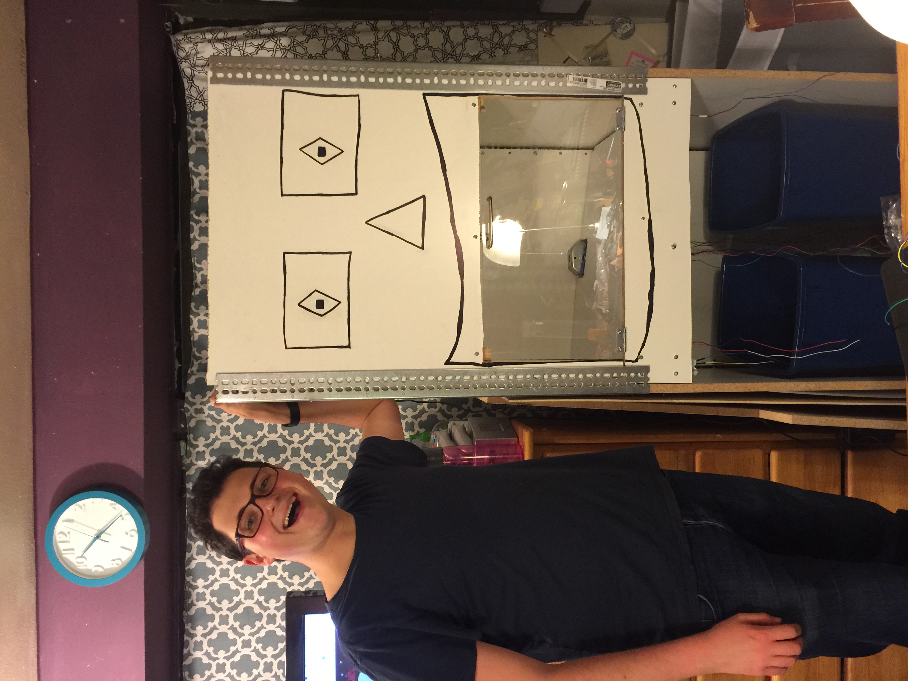

# Software Instructions:

### Unfortunately, we can't ship you a RecycleBot (yet).
* Luckily, we can help you set one up on your own!




For a better reading experience and to get the files you need, visit https://github.com/matthewblumberg/RecycleBot-Imagine-Cup
(That's where this ReadMe file is meant to live anyway!)

### Install ROS and other dependencies
* The local computer and Azure must both be running Ubuntu 12.04
* Follow instructions  at 
* Install ROS Packages on **Local Computer**

```  
sudo apt-get install ros-hydro-openni*  
sudo apt-get install ros-hydro-freenect*
```
* Install ROS Packages on **Azure**

```
sudo apt-get install ros-hydro-object-recognition* 
```

### Setup OpenVPN on Azure
* Follow instructions at http://azure-openvpn.github.io to setup OpenVPN on Azure

### Setup OpenVPN on Local Computer and set ROS environment variables
* Use **local computer browser** to connect to Azure at myazureinstance.azure.com:vpn_port  
* Enter your OpenVPN login info and download the appropriate config file.  

* Launch OpenVPN  on **Local Computer**

```
sudo openvpn --config myprofile.ovpn  
```

* Find **Azure and Local Computer's** IP addresses on the VPN

  * On each computer run `hostname -I`
  * One of the results should have the first 3 numbers in common, with a slightly different 4th number.
  *     E.g. `192.192.19.0` and `192.192.19.1`  
  * Take note of these numbers for the next step.


* Set environment variables on **Local Computer**

```    
export ROS_MASTER_URI=http://[azure_vpn_ip_address]:11311  
export ROS_IP=[local_computer_vpn_ip_address]
```

* Set environment variables on **Azure**

```
export ROS_MASTER_URI=http://[azure_vpn_ip_address]:11311
export ROS_IP=[azure_vpn_ip_address]
```

### Install Kinect drivers
* **On Local Computer**  

```
sudo apt-get install git  
git clone http://github.com/something/SensorKinect  
cd SensorKinect/platform/Linux/CreateRedist  
sudo sh ./RedistMaker  
cd ../Sens..  
./install.sh
```

### Setup Couchdb on Azure
* **On Azure**  

```
sudo couchdb&  
Follow object addition instructions
```

### Start ROS on Azure
* **On Azure**

```
roscore&
```

* You should now see `ros-agg` and `ros-output` when you run `rostopic list` on the local computer.  This means that ROS topics are able to communicate between the local computer and Azure

### Setup Arduinos
* One Arduino should be connected to the two stepper motors via a motor hat.  Our code works with the V1 Adafruit hat.
* This Arduino should have the motor.ino sketch from Arduino/motor/
* The other Arduino should be connected to the door sensor on pin A0, and the solenoids' relays on pins 9 and 8
* This Arduino should have the solenoids.ino sketch from Arduino/motor/
* The solenoids act as a sort of braking system to stop the platform from moving due to the weight of an object.
* See the fritzing diagram below:
![Fritzing Diagram]
(https://github.com/matthewblumberg/RecycleBot-Imagine-Cup/blob/master/fritz.png?raw=true)


### Setup listener.py
* The listener.py file contains the main logic that makes RecycleBot tick.
* Follow the instructions at http://wiki.ros.org/ROS/Tutorials/CreatingPackage to create your catkin workspace
* Next, follow the instructions at http://wiki.ros.org/ROS/Tutorials/WritingPublisherSubscriber(python)
* Last, replace the python file at /catkin_ws/scripts/listener.py with the listener.py in this repository
* Be sure to replace the `/dev/cu.usbmodem` or `/dev/cu.usbmodem*****` addresses on lines 16 and 17 with the correct addresses for the Arduinos on your local computer


```
roslaunch freenect_launch freenect.launch
rosrun rqt_reconfigure rqt_reconfigure
Click 'driver' and check the 'depth' box
```


### Start Freenect driver on the local computer
* The Freenect driver reads data from the Kinect and makes it available to ROS, including Azure.
* **On local computer**

```
roslaunch freenect_launch freenect.launch
(Then in a new tab)
rosrun rqt_reconfigure rqt_reconfigure
Click 'driver' and check the 'depth' box
```

### Train Object Recognition Algorithm
* Adapted from http://wg-perception.github.io/ork_tutorials/tutorial03/tutorial.html
* **On Azure**

```
rosrun object_recognition_core object_add.py -n coke -d "A universal can of coke"
(Take note of the Object ID from the object)
(coke.stl is included in this repository)
rosrun object_recognition_core mesh_add.py YOUR_OBJECT_ID /path/to/coke.stl --commit
rosrun object_recognition_core training -c `rospack find object_recognition_linemod`/conf/training.ork
```
        
### Start Object Recognition Algorithm
* **On Azure**

```
rosrun object_recognition_core detection -c  `rospack find object_recognition_linemod`/conf/detection.ros.ork
```

### Start Python Script that interfaces with the Arduinos
* This script is where the heart of the logic lives.  It checks if the door is open, listens for any recyclable recognition from Azure, and tells RecycleBot's Arduinos which way to turn and how to do it.
* **On local computer**  

```
cd /catkin_ws/devel
source setup.bash
rosrun beginner_tutorials listener.py
Note: sometimes there's a bug that makes it necessary to open the Serial Monitor in Arduino for the door sensor to work.
```

###Visualization
*    Optionally you can start rviz to visualize RecycleBot using `rosrun rviz rviz`

  *    Add PointCloud2
  *    Add ORK_Object
  *    
